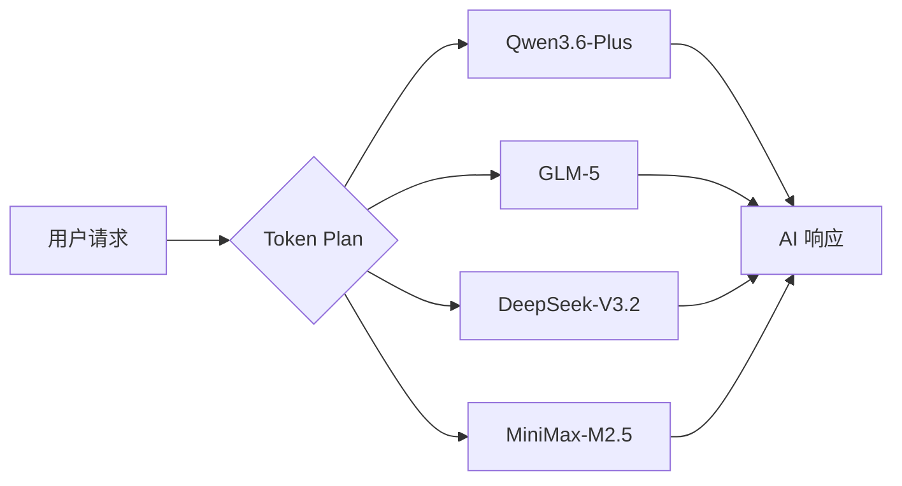

本页面演示 Mintlify 所有支持的内置组件，方便你快速了解每种组件的外观与用法。

---

## 📐 布局类组件

### Tabs — 标签页

<Tabs>
  <Tab title="First tab">
    ☝️ Welcome to the content that you can only see inside the first tab.

    ```java HelloWorld.java
      class HelloWorld {
          public static void main(String[] args) {
              System.out.println("Hello, World!");
          }
      }
    ```
  </Tab>
  <Tab title="Second" icon="alarm-clock-check">
    ✌️ Here's content that'sonly inside the second tab.

    This one has a <Icon icon="leaf" /> icon!

    ### ggg
  </Tab>
</Tabs>

---

### CodeGroup — 多语言代码组

<CodeGroup>

```python Python
import openai

client = openai.OpenAI(
    api_key="YOUR_API_KEY",
    base_url="https://api.qwencloud.com/v1"
)
```

```javascript Node.js
const OpenAI = require('openai');

const client = new OpenAI({
  apiKey: 'YOUR_API_KEY',
  baseURL: 'https://api.qwencloud.com/v1',
});
```

```bash cURL
curl https://api.qwencloud.com/v1/chat/completions \
  -H "Authorization: Bearer YOUR_API_KEY" \
  -H "Content-Type: application/json" \
  -d '{"model": "qwen3.6-plus", "messages": [{"role": "user", "content": "Hello"}]}'
```

</CodeGroup>

---

### Steps — 步骤列表

<Steps>
  <Step title="注册账号">
    前往 [home.qwencloud.com](https://home.qwencloud.com) 创建你的 Qwen Cloud 账号。
  </Step>
  <Step title="选择 Token Plan">
    在订阅页面选择适合你的套餐：Standard、Pro 或 Max。
  </Step>
  <Step title="获取 API Key">
    进入账号设置，生成并复制你的 API Key。
  </Step>
  <Step title="发送第一个请求">
    使用你的 API Key 向 Qwen Cloud 发送第一个 API 请求，开始 AI 编程之旅！
  </Step>
</Steps>

---

### Columns — 多列布局

---

### Panel — 侧边面板

<Panel>
  **💡 快速提示**

  使用 Panel 组件可以将补充性内容与主体内容区分开来，适合放置注意事项、相关链接或摘要信息。
</Panel>

---

## 🔔 强调类组件

### Callouts — 提示框

<Info>
  这是一个 **Info** 提示框，用于展示一般性信息或背景说明。
</Info>

<Note>
  这是一个 **Note** 提示框，用于补充说明或额外注释。
</Note>

<Tip>
  这是一个 **Tip** 提示框，适合分享实用技巧和最佳实践。
</Tip>

<Warning>
  这是一个 **Warning** 提示框，用于提醒用户注意潜在的问题或风险。
</Warning>

<Check>
  这是一个 **Check** 提示框，用于确认步骤完成或操作成功。
</Check>

<Danger>
  这是一个 **Danger** 提示框，用于标记危险操作，例如不可逆的删除行为。
</Danger>

---

### Badge — 徽章标签

当前版本：<Badge>v2.0</Badge>

状态：<Badge color="green">稳定</Badge> <Badge color="yellow">Beta</Badge> <Badge color="red">已弃用</Badge>

---

### Tooltip — 悬浮提示

将鼠标悬停在 <Tooltip tip="Qwen Cloud 提供统一的 Token Plan，让你一次订阅即可访问多个 AI 模型。">Token Plan</Tooltip> 上，查看更多说明。

---

### Frame — 图片边框

<Frame caption="Qwen Cloud 控制台示意图">
  
</Frame>

---

### Update — 更新记录

<Update label="2026-05-22">
  **新增模型支持**：Token Plan 现已支持 Qwen3.6-Plus、GLM-5、MiniMax-M2.5 和 DeepSeek-V3.2。
</Update>

<Update label="2026-04-01">
  **Claude Code 集成**：现在可通过 Anthropic 兼容端点使用 Claude Code CLI 消耗 Token Plan Credits。
</Update>

---

## 🤖 AI Prompt 组件

### Prompt — 可复制的 AI 提示词

<Prompt actions={["copy"]}>
你是一个专业的 AI 编程助手。请根据用户提供的需求，生成高质量的 Python 代码，并附上详细注释和使用示例。
</Prompt>

---

## 🙈 展开/隐藏类组件

### Accordion — 折叠面板

<AccordionGroup>
  <Accordion title="什么是 Token Plan？">
    Token Plan 是 Qwen Cloud 提供的订阅制服务，让你以固定月费获取大量 Credits，用于访问 Qwen、GLM、DeepSeek 和 MiniMax 等多个主流 AI 模型，比按量付费至少节省 40%。
  </Accordion>

  <Accordion title="Credits 如何消耗？">
    每次 API 调用根据输入和输出的 Token 数量消耗相应的 Credits。不同模型的消耗速率不同，大型模型（如 Max 系列）消耗更多。
  </Accordion>

  <Accordion title="Credit 用完了怎么办？" defaultOpen icon="align-start-vertical" iconType="solid">
    Credits 耗尽后，API 请求将返回错误，直到下个计费周期自动重置。你也可以随时升级到更高套餐来立即恢复访问。
  </Accordion>

  <Accordion title="是否支持退款？">
    Token Plan 暂不支持退款。取消订阅后，当前周期内的 Credits 和 API 访问权限仍会保留至到期日。
  </Accordion>
</AccordionGroup>

---

### Expandable — 可展开内容块

<Expandable title="查看完整的请求示例">
  ```json
  {
    "model": "qwen3.6-plus",
    "messages": [
      {
        "role": "system",
        "content": "You are a helpful coding assistant."
      },
      {
        "role": "user",
        "content": "Write a Python function to calculate fibonacci numbers."
      }
    ],
    "max_tokens": 1024,
    "temperature": 0.7
  }
  ```
</Expandable>

---

## 🔗 导航/链接类组件

### Cards — 卡片

<Columns cols={2}>
  <Card title="Token Plan 概览" icon="credit-card" href="/token-plan/overview">
    了解 Qwen Cloud Token Plan 如何让你一次订阅访问多个主流 AI 模型。
  </Card>

  <Card title="API 参考文档" icon="code" href="/api-reference/introduction">
    查阅 OpenAI 兼容接口的完整文档，包括认证方式和端点说明。
  </Card>

  <Card title="定价方案" type="tip" icon="tag" href="/token-plan/pricing">
    比较 Standard、Pro 和 Max 三档套餐，找到最适合你的方案。
  </Card>

  <Card title="常见问题" type="note" icon="circle-help" href="/account/faq">
    解答关于订阅、Credits、退款和多用户访问的常见疑问。
  </Card>
</Columns>

---

### Tiles — 图块网格

<Tiles>
  <Tile title="Qwen Code" icon="terminal" href="/token-plan/tools/qwen-code">
    阿里巴巴官方 AI 编程工具
  </Tile>

  <Tile title="Cline" icon="plug" href="/token-plan/tools/cline">
    VS Code 扩展，AI 辅助编程
  </Tile>

  <Tile title="Cursor" icon="mouse-pointer" href="/token-plan/tools/cursor">
    内置 AI 的智能 IDE
  </Tile>

  <Tile title="Claude Code" icon="bot" href="/token-plan/tools/claude-code">
    Anthropic 兼容端点支持
  </Tile>
</Tiles>

---

## 📊 API 文档类组件

### ParamField — 请求参数说明

<ParamField path="model" type="string" required>
  要调用的模型 ID，例如 `qwen3.6-plus`、`glm-5`、`deepseek-v3.2`。
</ParamField>

<ParamField path="messages" type="array" required>
  对话消息数组，每条消息包含 `role`（`system`、`user` 或 `assistant`）和 `content` 字段。
</ParamField>

<ParamField path="max_tokens" default="1024" type="integer">
  生成内容的最大 Token 数量。
</ParamField>

<ParamField path="temperature" default="1.0" type="number">
  控制输出的随机性，取值范围 `0.0`–`2.0`。值越低输出越确定，值越高输出越多样。
</ParamField>

<ParamField path="stream" default="false" type="boolean">
  是否启用流式输出（Server-Sent Events）。
</ParamField>

---

### ResponseField — 响应字段说明

<ResponseField name="id" type="string">
  本次请求的唯一标识符，格式为 `chatcmpl-xxxxxxxx`。
</ResponseField>

<ResponseField name="choices" type="array">
  模型生成的候选回复列表。

  <Expandable title="choices 字段详情">
    <ResponseField name="choices[].message" type="object">
      助手生成的消息对象，包含 `role` 和 `content`。
    </ResponseField>

    <ResponseField name="choices[].finish_reason" type="string">
      停止生成的原因：`stop`、`length` 或 `content_filter`。
    </ResponseField>
  </Expandable>
</ResponseField>

<ResponseField name="usage" type="object">
  本次请求的 Token 用量统计。

  <Expandable title="usage 字段详情">
    <ResponseField name="usage.prompt_tokens" type="integer">
      输入部分消耗的 Token 数量。
    </ResponseField>

    <ResponseField name="usage.completion_tokens" type="integer">
      输出部分消耗的 Token 数量。
    </ResponseField>

    <ResponseField name="usage.total_tokens" type="integer">
      本次请求消耗的 Token 总量。
    </ResponseField>
  </Expandable>
</ResponseField>

---

## 🎨 视觉类组件

### Icon — 图标

常用图标示例： <Icon icon="star" /> 收藏   <Icon icon="rocket" /> 快速开始   <Icon icon="shield-check" /> 安全认证   <Icon icon="zap" /> 高性能   <Icon icon="globe" /> 全球访问

---

### Mermaid — 流程图



---

### Color — 颜色色板

品牌主色：

<Color hex="#6366f1">
  <Color.Item name="gray-200" value="#E7E5E4" />
  <Color.Item name="gray-200" value="#be5d2d" />
</Color>

<Color hex="#22c55e">
</Color>

<Color hex="#f59e0b">
</Color>

<Color hex="#ef4444">
</Color>

<Color hex="#3b82f6">
</Color>

---

### Tree — 文件树结构

<Tree />

---

<Check>
  🎉 恭喜！你已经浏览了 Mintlify 所有支持的内置组件。如需深入了解某个组件，请参阅 [Mintlify 官方文档](https://mintlify.com/docs/components)。
</Check>